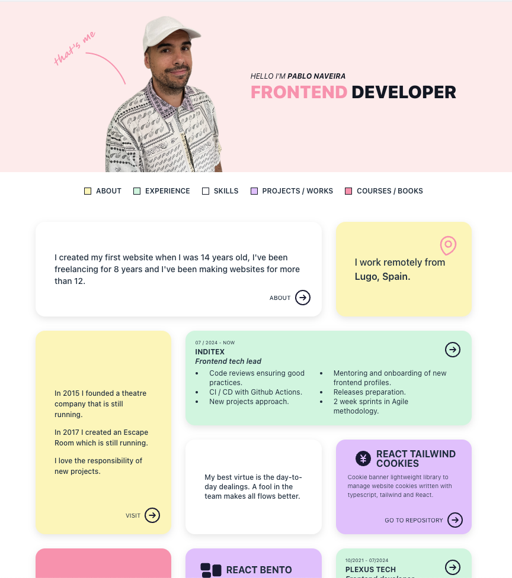

`react-bento` is a component library for creating dynamic and flexible layouts inspired by Bento box design. It allows you to organize items in a grid with support for custom dimensions, colors, and more.

# Real example



You can see the real example [here](https://www.pablonaveira.dev)

# Getting started

Install the library using npm or yarn:

```bash
npm install react-bento
```

or

```bash
yarn add react-bento
```

## Usage

Here is an example of how to use `react-bento`:

### Import the Library

```javascript
import { BentoGrid } from "react-bento";
import "react-bento/dist/index.css"; // Ensure you import the CSS file
```

### Define Your Items

```javascript
import React from "react";

const bentoItems = [
  {
    id: 3,
    title: "Item 3",
    color: "bg-state-yellow",
    element: (
      <div className="flex-col justify-center space-y-3 items-center h-full px-4 flex relative">
        <p className="text-[12px] sm:text-medium font-medium -mt-8 sm:mt-0 relative">
          In 2015 I founded a theatre company that is still running.
        </p>
        <p className="text-[12px] sm:text-medium font-medium relative">
          In 2017 I created an Escape Room which is still running.
        </p>
        <p className="text-[12px] sm:text-medium font-medium relative">
          I love the responsibility of new projects.
        </p>
        <ActionLink
          className="absolute right-0 bottom-0"
          label="Visit"
          path="https://www.linkedin.com/in/pablonaveira/"
        />
      </div>
    ),
    width: 1,
    height: 2,
  },
  {
    id: 4,
    color: "bg-state-green",
    title: "Item 4",
    element: (
      <WorkItem
        time="07 / 2024 - NOW"
        place="Inditex"
        job="Frontend tech lead"
        link="Skills"
        className="absolute top-0 right-0"
        workDetails={
          <ul className="w-full text-[10px] sm:text-xs list-disc grid grid-cols-2 px-4">
            <li className="px-2">Code reviews ensuring good practices.</li>
            <li className="px-2">
              Mentoring and onboarding of new frontend profiles.
            </li>
            <li className="px-2">CI / CD with Github Actions.</li>
            <li className="px-2">Releases preparation.</li>
            <li className="px-2">New projects approach.</li>
            <li className="px-2">2 week sprints in Agile methodology.</li>
          </ul>
        }
      />
    ),
    width: 2,
    height: 1,
  },
  {
    id: 5,
    title: "Item 5",
    element: (
      <div className="flex justify-center items-center h-full text-xs sm:text-normal p-4 font-medium relative">
        My best virtue is the day-to-day dealings. A fool in the team makes all
        flows better.
      </div>
    ),
    width: 1,
    height: 1,
  },
];
```

### Render the Bento Grid

```javascript
const MyBentoGrid = () => {
  return (
    <BentoGrid
      items={bentoItems}
      gridCols={4}
      rowHeight={100}
      classNames={{
        container: "my-custom-container-class",
        elementContainer: "my-custom-element-class",
      }}
    />
  );
};

export default MyBentoGrid;
```

## Types

The following types are used in `react-bento`:

```typescript
import React from "react";

export type BentoItem = {
  id: number;
  title: string;
  element: React.ReactNode;
  width: number;
  color?: string;
  height: number;
};

export type BentoItems = BentoItem[];

export type ClassNames = {
  container?: string;
  elementContainer?: string;
};

export type BentoGridProps = {
  items: BentoItems;
  gridCols?: number;
  rowHeight?: number;
  classNames: ClassNames;
};
```

## License

This project is licensed under the MIT License.
